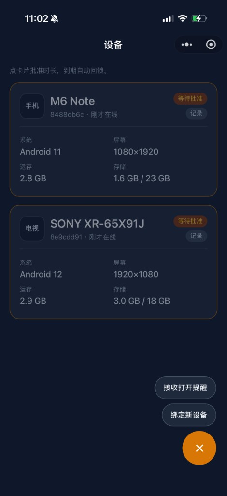
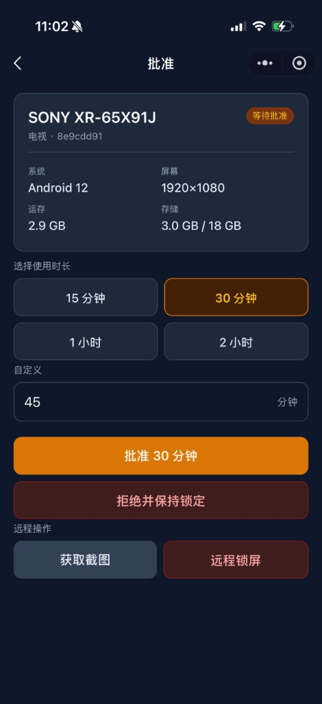
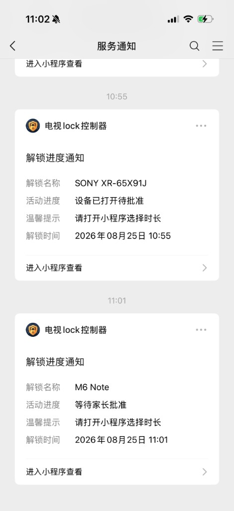
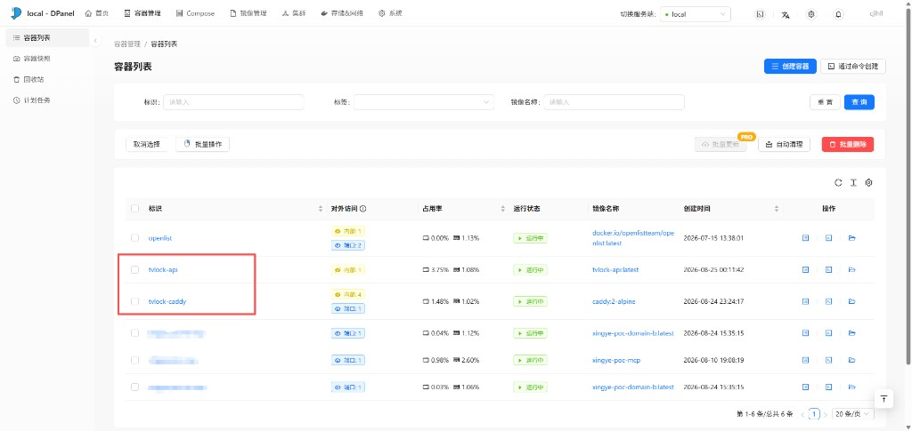

# TV Lock

家用限时解锁：被控 Android 设备（手机 / 索尼等 Android TV）开机或唤醒后先锁屏，家长在微信小程序批准并选择时长后才能使用，到期自动回锁。

别人拿这份代码，可以用**自己的小程序、自己的服务端、自己的 APK**，数据不经过作者的账号和服务器。小程序仍然运行在微信里（登录、订阅消息走微信），业务状态机在你自己的 API 上。

联调细节见 [docs/setup.md](docs/setup.md)。

## 截图

设备列表：点卡片批准时长，到期自动回锁。



批准页：预设或自定义时长，也可远程截图、远程锁屏。



微信服务通知：设备打开后推送给家长，点进小程序选时长。



服务端：API 与 Caddy 以 Docker 运行，可用任意容器面板管理。



## 能做什么

- 开机 / 睡眠唤醒先全屏锁屏，未批准不能进桌面
- 扫码或 6 位配对码绑定多个家长微信
- 申请解锁后订阅消息提醒家长，点开选 15 / 30 / 60 / 120 分钟或自定义
- 到期或远程锁屏后自动回锁；断网时本机倒计时仍会回锁
- 本机 PIN 应急解锁；家长可远程截图
- 同一 APK 兼顾手机与 Android TV（Leanback、遥控器方向键 / 确定 / 返回 / 睡眠）
- Device Owner + Lock Task：锁定时 Home / 最近任务无效

## 三端

```
被控 APK  --POST /api-->  自建 Node API（Docker）
微信小程序 --wx.request-->  同一套 action
```

| 端 | 目录 | 说明 |
|---|---|---|
| 被控设备 | `android/` | Kotlin，包名默认 `com.cjlhll.tvlock` |
| 家长端 | `miniprogram/` | 微信小程序：设备列表、绑定、批准、记录 |
| 服务端 | `cloud/local-server/` + `cloudfunctions/api/logic.js` | Docker 部署；逻辑与云函数共用，**默认不走微信云开发** |

状态：`unbound`（未扫码）→ `locked` / `pending`（等批准）→ `unlocked`（`unlockUntil` 未到期）。

没有小程序时，也可用服务端自带的审批页或 `curl` 批准。

## 自己部署一套

1. **服务端**：有 Docker 的机器上跑 `tvlock-api` + Caddy，配自己的 HTTPS 域名。复制 `cloud/local-server/.env.example` 为 `.env`，填自己的 `WECHAT_APPID` / `WECHAT_SECRET` / 订阅模板 ID。`MINIPROGRAM_STATE=formal` 时，通知点进正式版小程序。
2. **小程序**：用自己的 AppID 打开本仓库，改 [`miniprogram/env.js`](miniprogram/env.js) 的 `localApiUrl`，公众平台把该域名写入 request 合法域名，按需上架。
3. **APK**：把默认服务器改成你的 `https://你的域名/api`，再 `assembleRelease` 装到被控设备。需要强锁时设 Device Owner。

```bash
# 逻辑单测
node cloudfunctions/api/logic.test.js

# 本机 API
node cloud/local-server/server.js

# 编被控包
cd android && ./gradlew :app:assembleRelease
```

远程 Docker 部署：配好 SSH 后执行 `./scripts/deploy-api.sh`（脚本里的主机、路径可按自己的环境改）。

## 配置要点

| 位置 | 改什么 |
|---|---|
| `miniprogram/env.js` | `localApiUrl` |
| `project.config.json` | 你的小程序 AppID |
| `cloud/local-server/.env` | 微信密钥与 `MINIPROGRAM_STATE`（已 gitignore，不要提交） |
| Android 设置页 / `AppPrefs.DEFAULT_SERVER` | APK 使用的 API 地址 |

订阅消息模板字段：`thing1` 解锁名称、`thing2` 活动进度、`thing3` 温馨提示、`time4` 解锁时间。一次性订阅，家长同意一次只能推一条，需在小程序里再次点「接收打开提醒」。

## 仓库结构

```
android/                 被控 APK
miniprogram/             微信小程序
cloudfunctions/api/      状态机 logic.js（API 与云函数共用）
cloud/local-server/      自建 API、Docker、Caddy、审批页
docs/setup.md            装机与联调
scripts/                 部署、找 adb、装包
```

## 注意

- 不要把 `.env`、`data.json`、`android/local.properties`、PIN 明文推进公开仓库。
- Device Owner 要求设备上先没有账号；卸管理权：`adb shell dpm remove-active-admin com.cjlhll.tvlock/.lock.LockAdminReceiver`。
- 电视遥控器锁定时默认只放行方向键、确定、返回、睡眠；音量由系统限制冻结。
- 索尼等电视的唤醒路径（`SCREEN_ON` / `DREAMING_STOPPED`）需在实机再测，手机通过不等于电视通过。

## 许可证

发布到 GitHub 前请自行加上许可证文件（例如 MIT）。未添加时，默认保留所有权利。
